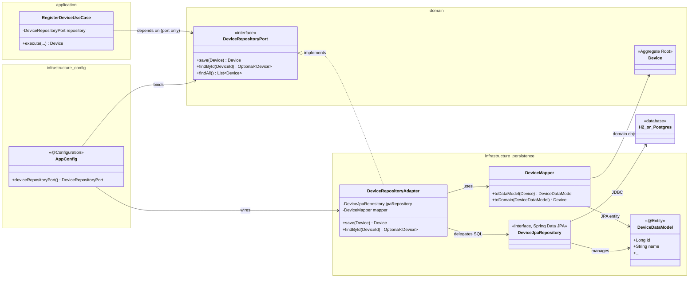

# Persistence — Ports & Adapters

Diagrama de como a persistência SQL está planeada para o nurseApp, seguindo
Ports & Adapters (DD-004 em [design-decisions.md](design-decisions.md)).
Usa `Device`/`DeviceRepositoryPort` como exemplo ilustrativo; o mesmo padrão
aplica-se a cada Aggregate Root (`User`, `OperatingRoom`, `Shift`, ...).

**Regra de dependência:** as setas de `application` e `domain` apontam sempre
para dentro — nunca para `infrastructure`. Só `infrastructure/persistence`
depende de JPA/Hibernate.

Estado atual (2026-08-17): o padrão está decidido e as pastas existem
(`domain/repository`, `infrastructure/persistence`), mas nenhum port, adapter,
data model ou mapper concreto foi ainda implementado — ver
[US007 — Production Database](../user-stories/phase-2-implementation/US007-production-database.md)
para a base de dados de produção, ainda por fazer.
